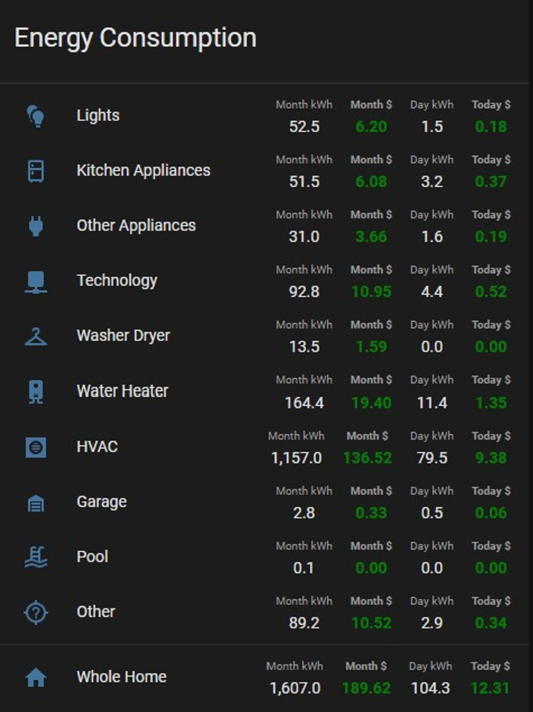

# My approach to energy management


I started measuring my home energy use about 3 years ago.  In the beginning it was just interesting to get things setup and see my total usage.  It gave me some insights, but I found myself wanting a more granular level of detail that would allow me to more quickly identify problem areas and opportunities for improvement.

About 18 months ago I purchased two [Emporia Gen2 Vue](https://shop.emporiaenergy.com/collections/emporia-products/products/gen-2-emporia-vue-with-16-sensors-bundle) devices and outfitted 16 circuits in each of my two electrical panels.  Being able to report on the total power usage as well as details of 32 selected circuits gives a really nice level of detail.


## Thoughts on Emporia Gen2 Vue
I purchased the Vue2 devices because of the well thought out design, attractive pricing, and at that time, Emporia was saying local API was on their roadmap... based on many inquiries and Emporia's forum responses, it doesn't seem like that will ever happen.

Until a week ago, I had been using the custom_component integration that was written by [magico13](https://github.com/magico13/ha-emporia-vue). That served me well, but it requires cloud accounts is limited to 1 minute reporting because of load on cloud servers.  One minute reporting is still very good, and probably covers 98% of the use cases that anyone would have.

That said, I always felt a little cheated that I couldn't access the full capabilities of the device in Home Assistant.  Last week I stumbled accross [this fantastic project](https://gist.github.com/flaviut/93a1212c7b165c7674693a45ad52c512#file-setting-up-emporia-vue-2-with-esphome-md) where a group reverse engineered the Vue device and provided instructions to **flash with ESPHome!** I flashed both units later that day, and after a few small hurdles, I had everything working perfectly.  I finally have this unit working exactly as I originally anticpated with the ability to see realtime data with updates few seconds.

## Home Assistant Energy Dashboard
The Home Assistant developers have done a great job adding in better support for monitoring energy.  Nice looking dashboards with improved statistics and reporting capabilities.  All the work I've done can also take advantage of those built in features.  I'd like to see native capabilities to more easily group devices together for energy reporting and show real time power reporting as I've done in mine, but I'm guessing it will come at some point.  For my HA energy dashboard, I'm only monitoring my device groups, not individual devices since I have that in my custom dashboard.  I also have more detailed reporting in Influx/Grafana, but that's a separate discussion.


## General concepts for my approach
I'll start out by saying that not everyone will agree with everything I do in my approach toward this. (i.e. basing a lot of this on entity_id naming and not aiming for "Pefect" measurements of energy usage) That said, there are always limitations and compromises to consider, and based on a good amount of research, trial, and error, I think this is a pretty good compromise. It definitely gives me a clear and detailed understanding of my usage.

Here are the key points in my configuration:
- I only store and report data from power and energy sensors that I've created with templates. This allows to ensure consistent naming and attributes since I use power details from many different integrations and sensors.  This is very important when you want to use things like filters or templates to minimize the amount of manual group management required.
- Similar to the point above, you should consider excluding unused power and energy sensors from the recorder to minimize data size and performance impact.
- I keep all of my energy configuration in single package yaml file for easy management.  If you aren't using the package directory approach for managing and organizing at least your complex configurations, you should look into it.


## Backend Configuration:
### Create an input_number to store your energy cost
You can also reference this entity in the native energy dashboard, so it is dual purpose.  Note I do not have variable energy rates, so that would add some complexity that I'm not covering here.
```
input_number:
  energy_kwh_cost:
    name: Energy kWh Cost
    icon: mdi:currency-usd
    mode: box
    unit_of_measurement: "USD/kWh"
    min: 0.001
    max: 1
```
### Create a template trigger for all energy sensors
The reason for the trigger template for sensors is to control the number of updates that would occur otherwise.  In my case I'm having teh templates evaluate and capture energy data from all sensors and groups every 5 seconds.  So my trigger is a 5 second pattern. You can change that to your needs, but your database will grow very quickly and performance will suffer if you aren't careful. 

**IMPORTANT:** If you use a regular template sensor without a trigger for a group of devices, you will likely have issues.  Consider a group with 10 devices getting updates every 1 second.  That template will re-evaluate every time each one of those devices reports.  That's at least 10+ updates per second for each group sensor which over days and weeks will add up up to issues.

```
template:
  - trigger:
      # IMPORTANT - You must use some time pattern at least for at least the calculation of the groups, otherwise, it
      # recalculates that whole group every time one of the sensors changes.  This could end up being many times per
      # second which will signficantly impact data size and performance due to the number of state changes.
      # NOTE - This approach does somewhat impact the accuracy of your data since it is not averaging the data in
      # between the time periods, but it will still end up being relatively close and give you a good data
      # about energy usage
      - platform: time_pattern
        seconds: "/5" #Only pull electric data every 5 seconds to minimize data / performance impact
      - platform: homeassistant
        event: start
      - platform: event
        event_type: "call_service"
        event_data:
          domain: "template"
          service: "reload"
    sensor:
      ################  Electrical Panel #1 Voltage ###############
      - name: electric_home_voltage
        attributes:
          tmp_friendly_name: "Electric Home Voltage"
          <<: &voltage_sensor_force_update
            min_last_updated: "{{ now().minute }}" #Forces reporting every 1 min
        <<: &voltage_sensor_defaults
          device_class: voltage
          unit_of_measurement: "V"
          state_class: measurement
        state: "{{ (states('sensor.electric_p1_phase_a_voltage') | float(0) + states('sensor.electric_p1_phase_b_voltage') | float(0)) | round(1) }}"
      - name: electric_home_l1_voltage
        attributes:
          tmp_friendly_name: "Electric Home Leg 1 Voltage"
          <<: *voltage_sensor_force_update
        <<: *voltage_sensor_defaults
        state: "{{ (states('sensor.electric_p1_phase_a_voltage') | float(0)) | round(1) }}"
      - name: electric_home_l2_voltage
        attributes:
          tmp_friendly_name: "Electric Home Leg 2 Voltage"
          <<: *voltage_sensor_force_update
        <<: *voltage_sensor_defaults
        state: "{{ (states('sensor.electric_p1_phase_b_voltage') | float(0)) | round(1) }}"

      ################  Electrical Whole Home Power ###############
      - name: electric_home_total_power
        attributes:
          tmp_friendly_name: "Electric Home Total Power"
          <<: &power_sensor_force_update
            two_min_update: " {{now().minute}}  {{now().minute - 1 }} " #Ensure updates occur at least every 2 min for influx reporting
        state: "{{ (states('sensor.p1_00_total_power') | float(0) + states('sensor.p2_00_total_power') | float(0)) | round(1)  }}"
        <<: &power_sensor_defaults
          device_class: power
          unit_of_measurement: "W"
          state_class: measurement

      ################  Electrical Panel #1 Power ###############
      # Note - Subtracting out power in the templates is not perfect.  The circuits get updated every x seconds from Emporia vue, but the change to the virtual circuits happens immediately.
      # Currently handling by simply not allowing the total power of the circuit to go negative which is why max() filter is in use. (i.e. 0 is bigger than negative so max will return that)
      - name: p1_00_total_power
        attributes:
          tmp_friendly_name: "Electric Panel 1 Total Power"
          <<: *power_sensor_force_update
        state: "{{ max( states('sensor.electric_p1_total_power') | float(0) | round(1), 0.0 ) }}"
        <<: *power_sensor_defaults
      - name: p1_01_first_floor_hvac_ahu_1_power
        attributes:
          tmp_friendly_name: "First Floor HVAC AHU 1 Power"
          <<: *power_sensor_force_update
        state: "{{ max( states('sensor.fl1_air_handler_p1_1_power') | float(0) | round(1), 0.0 ) }}"
        <<: *power_sensor_defaults
      - name: p1_02_first_floor_hvac_ahu_2_power
        attributes:
          tmp_friendly_name: "First Floor HVAC AHU 2 Power"
          <<: *power_sensor_force_update
        state: "{{ max( states('sensor.fl1_air_handler_p1_2_power') | float(0) | round(1), 0.0 ) }}"
        <<: *power_sensor_defaults
      - name: p1_03_kitchen_gfci_power
        attributes:
          tmp_friendly_name: "Kitchen GFCI Power"
          <<: *power_sensor_force_update
        state: "{{ max( states('sensor.kitchen_gfci_p1_3_power') | float(0) | round(1), 0.0 ) }}"
        <<: *power_sensor_defaults
      - name: p1_04_office_power
        attributes:
          tmp_friendly_name: "Office Power"
          <<: *power_sensor_force_update
        state: >-
          
          {{ max( (states('sensor.office_p1_4_power') | float(0) - virtualpower) | round(1), 0.0 ) }}
        <<: *power_sensor_defaults
      - name: p1_04_v_office_floor_light_power
        attributes:
          tmp_friendly_name: "Office Floor Light Power"
          <<: *power_sensor_force_update
        state: "{{ max( (5 * 8 * state_attr('light.office_floor_light','brightness') | float(0) / 255) | round(1), 0.0 ) }}"
        <<: *power_sensor_defaults
      - name: p1_04_v_office_computer_outlet_power
        attributes:
          tmp_friendly_name: "Office Computer Outlet Power"
          <<: *power_sensor_force_update
        state: "{{ max( states('sensor.office_computer_outlet_power') | float(0) | round(1), 0.0 ) }}"
        <<: *power_sensor_defaults
      - name: p1_05_kitchen_refrigerator_power
        attributes:
          tmp_friendly_name: "Kitchen Refrigerator Power"
          <<: *power_sensor_force_update
        state: "{{ max( states('sensor.kitchen_refrigerator_p1_5_power') | float(0) | round(1), 0.0 ) }}"
        <<: *power_sensor_defaults
      - name: p1_06_kitchen_dishwasher_power
        attributes:
          tmp_friendly_name: "Kitchen Dishwasher Power"
          <<: *power_sensor_force_update
        state: "{{ max( states('sensor.dishwasher_p1_6_power') | float(0) | round(1), 0.0 ) }}"
        <<: *power_sensor_defaults
        
<<<<<<<<<<<<<<<<<<<<<<<<<<  Truncated  >>>>>>>>>>>>>>>>>>>>>>>>>>>
```

In the snip of yaml above, it proably looks a little complex, but take a look at each entry and it gets a little easier.  A few key points:
* I am using yaml anchors to simplify, thats why you see the "<<: &" and "<<: *".  It's like declaring a variable, then allows use of those items throughout your code.
* The names are structured and specific. In the case of p1_00_total_power, that is the total power being delivered by electric panel 1, while p1_04_office_power is electric panel 1, the 4th monitored circuit.  
* Take note of the next entry which is p1_04_v_office_floor_light_power. The "v" is meant to stand for virtual, which means it will be used for some calculations on that circuit.  This naming structure allows easy automated creation of "circuit groups" that make up the known loads on each circuit.  By subtracting the known loads from the circuit, you are left with the remaining power so nothing is double counted in reporting totals.
* The use of "max( x, 0.0)" in most of the states is an easy way of preventing negative power readings which are typically noise or could also occur briefly due to the way calculations are being done

### Calculating the values the power sensors templates
Notice there are several ways to get power usage:
* Direct from another power sensor: 
>`{{ max( states('sensor.fl1_air_handler_p1_1_power') | float(0) | round(1), 0.0 ) }}`
* Adding sensors together:
>`{{ (states('sensor.electric_p1_phase_a_voltage') | float(0) + states('sensor.electric_p1_phase_b_voltage') | float(0)) | round(1) }}`
* You don't need to have true energy monitoring on devices to track power usage.  If you can determine whether the device is on or off, and you can estimate is power while on, then just calculate it in a template.  Granted it is an estimate, but if can give you a lot more information if you are OK with the compromise.  Use the p1_04_v_office_floor_light_power example again. That template is calculating an energy value estimate based on 5 bulbs x 8 watts each x brightness of the light to determine power usage.
>`{{ (5 * 8 * state_attr('light.office_floor_light','brightness') | float(0) / 255) | round(1) }}`
* Same as above, but when only on / off are known for a 45W device: 
>`{{ 45| float(0) | round(1)}}{{ 0 | float(0) | round(1) }}`
* More complex calculations can also be done using templates and groups.  In the case of p1_04_office_power, that is a monitored circuit with multiple loads.  The known loads are listed with the `_v_` designations so they can be automatically placed into groups to be subtracted from that circuit.  With this approach, the value of p1_04_office_power ends up only being the remaining power of the circuit after the known loads are removed.  Without calculation the p1_04_office_power circuit would be 77.4W, which would be double counting the loads on that circuit that are also being measured.
>`
          {{ max( (states('sensor.office_p1_4_power') | float(0) - virtualpower) | round(1), 0.0 ) }`
          

 
### Creating power sensors for devices in a group
In this example, the template will expand out group.water_heater_group_total_power and add the power usage of all the sensors in that group.  The resulting sensor created will be sensor.water_heater_group_total_power. Note the different entities even group name is the same as the sensor name, that is just for easy management.  In the example picture, this sensor would just be the "head" entry total for kitchen appliances, the sum of all the values in the group shown.
**IMPORTANT:** This should be done in a trigger template, otherwise will constantly be recalculating.  See warnings above.
```
      - name: kitchen_appliance_group_total_power
        icon: mdi:fridge-outline
        state: >-
          
          {{ max( virtualpower | round(1), 0.0 ) }}
        attributes:
          tmp_friendly_name: "Kitchen Appliance Group Total Power"
          <<: *power_sensor_force_update
        <<: *power_sensor_defaults
```


### Creating groups of power sensors
One option is to just manually create the groups you want to monitor, then use the formulas found above to calulate total power usage of that group of sensors.  I wanted to automate that group creation and maintenance based on entity names.  Again not everyone is supportive of this approach, and it does take some good naming structure for it to work properly, but it's working well for me.
```
automation:
  ################  Create and update power groupings for circuits and devices  ###############
  - alias: "Update Power Groups"
    trigger:
      - platform: homeassistant
        event: start
      - platform: event
        event_type: "call_service"
        event_data:
          domain: "group"
          service: "reload"
    action:
      - service: group.set
        data_template:
          object_id: p1_04_v_power
          entities: >
            
            
              
            
            {{ ns.entities }}
      - service: group.set
        data_template:
          object_id: kitchen_appliance_group_total_power
          entities: >
            
            
              
            
            {{ ns.entities }}
```

## Simplifying the energy calculations
For some reason it was difficult for me to understand what needed to be done to convert from power to energy.  Power is measured in Watts or kiloWatts, but I am only using Watts in my measurements.  Energy is generally measured in kWh (kiloWatt hours).  If you are measuring your power in Watts, you can easily track your energy/kWh by following the patterns in the following 3 sections.

### Create sensors for hourly energy calculations
These sensors continuously calculate the kWh over the past hour which allows the utility meter integration to capture the daily and monthly energy consumption from this data.

```
sensor:
  ################  Total hourly energy calculation  ###############
  - platform: integration
    name: electric_home_total_energy
    source: sensor.electric_home_total_power
    <<: &energy_calculation_defaults
      unit_time: h
      unit_prefix: k
      round: 2
  - platform: integration
    name: kitchen_appliance_group_total_energy
    source: sensor.kitchen_appliance_group_total_power
    <<: *energy_calculation_defaults
```

### Tracking consumption with the utility_meter
These sensors are what will be used for actual reporting of usage per day or per month in kWh
```
utility_meter:
  ################  Track daily consumption for each grouping  ###############
  electric_home_daily_total_energy:
    source: sensor.electric_home_total_energy
    cycle: daily
  kitchen_appliance_group_daily_total_energy:
    source: sensor.kitchen_appliance_group_total_energy
    cycle: daily
      ################  Track monthly consumption for each grouping  ###############
  electric_home_monthly_total_energy:
    source: sensor.electric_home_total_energy
    cycle: monthly
  kitchen_appliance_group_monthly_total_energy:
    source: sensor.kitchen_appliance_group_total_energy
    cycle: monthly
```

### Calculating Cost

```
sensor:
  - platform: template
    sensors:
      ################  Calculate daily energy cost for each grouping  ###############
      electric_home_daily_total_energy_cost:
        friendly_name: "Electric Home Daily Total Energy Cost"
        value_template: >-
          {{ max( (states('sensor.electric_home_daily_total_energy') | float(0) * states('input_number.energy_kwh_cost') | float(0)) | round(2), 0.00 ) }}
        <<: &energy_cost_defaults
          unit_of_measurement: "$"
          icon_template: mdi:currency-usd
      kitchen_appliance_group_daily_total_energy_cost:
        friendly_name: "Kitchen Appliance Group Daily Total Energy Cost"
        value_template: >-
          {{ max( (states('sensor.kitchen_appliance_group_daily_total_energy') | float(0) * states('input_number.energy_kwh_cost') | float(0)) | round(2), 0.00 ) }}
        <<: *energy_cost_defaults
      ################  Calculate monthly energy cost for each grouping  ###############
      electric_home_monthly_total_energy_cost:
        friendly_name: "Electric Home Monthly Total Energy Cost"
        value_template: >-
          {{ max( (states('sensor.electric_home_monthly_total_energy') | float(0) * states('input_number.energy_kwh_cost') | float(0)) | round(2), 0.00 ) }}
        <<: *energy_cost_defaults
      kitchen_appliance_group_monthly_total_energy_cost:
        friendly_name: "Kitchen Appliance Group Monthly Total Energy Cost"
        value_template: >-
          {{ max( (states('sensor.kitchen_appliance_group_monthly_total_energy') | float(0) * states('input_number.energy_kwh_cost') | float(0)) | round(2), 0.00 ) }}
        <<: *energy_cost_defaults
```

## Bringing it all together in the UI
Last year, around earth day, I decided it would be a good time to update my dashboards with a focus on energy throughout.  Each one of my dashboard pages has energy details at the top to keep it visible and top of mind.  Here are some examples:

```
title: "" #########################  Home  #########################
icon: mdi:home
cards:
  - type: vertical-stack
    cards:
      - type: entities
        title: "Home"
        icon: mdi:home
        show_header_toggle: false
        entities:
          - type: section
          - entity: sensor.electric_home_daily_total_energy_cost
            type: custom:multiple-entity-row
            name: Energy
            icon: mdi:flash-outline
            state_header: Today $
            format: precision2
            secondary_info: false
            unit: false
            styles:
              font-weight: bold
              color: green
              width: 34px
            entities:
              - entity: sensor.electric_home_monthly_total_energy
                name: Month kWh
                format: precision0
                unit: false
                styles:
                  width: 34px
              - entity: sensor.electric_home_monthly_total_energy_cost
                name: Month $
                format: precision2
                unit: false
                styles:
                  color: green
                  width: 34px
              - entity: sensor.electric_home_daily_total_energy
                name: Today kWh
                format: precision1
                unit: false
                styles:
                  width: 34px
          - entity: sensor.count_outside_fans_on
            type: custom:multiple-entity-row
            name: "On"
            icon: mdi:lightbulb-group
            state_header: Out Fans
            format: precision0
            secondary_info: false
            unit: false
            entities:
              - entity: sensor.count_inside_lights_on
                name: In Lights
                format: precision0
                unit: false
              - entity: sensor.count_inside_fans_on
                name: In Fans
                format: precision0
                unit: false
              - entity: sensor.count_outside_lights_on
                name: Out Lights
                format: precision0
                unit: false
          - entity: sensor.count_doors_open
            type: custom:multiple-entity-row
            name: "Security"
            icon: mdi:shield
            state_header: ""
            format: precision0
            secondary_info: false
            unit: false
            show_state: false
            entities:
              - entity: sensor.count_garage_doors_open
                name: "Garage Open"
                format: precision0
                unit: false
              - entity: sensor.count_doors_open
                name: "Doors Open"
                format: precision0
                unit: false
```

```
title: "" #########################  Lights  #########################
icon: mdi:lightbulb-multiple
cards:
  ## Heating and cooling
  - type: entities
    title: "Lighting"
    icon: mdi:lightbulb-group
    show_header_toggle: false
    entities:
      - type: section
      - entity: sensor.light_group_daily_total_energy_cost
        type: custom:multiple-entity-row
        name: Energy
        icon: mdi:flash-outline
        state_header: Today $
        format: precision2
        secondary_info: false
        unit: false
        styles:
          font-weight: bold
          text-align: right
          color: green
        entities:
          - entity: sensor.light_group_monthly_total_energy
            name: Month kWh
            format: precision1
            unit: false
          - entity: sensor.light_group_monthly_total_energy_cost
            name: Month $
            format: precision2
            unit: false
            styles:
              font-weight: bold
              text-align: right
              color: green
          - entity: sensor.light_group_daily_total_energy
            name: Today kWh
            format: precision1
            unit: false
      - type: custom:fold-entity-row
        head:
          entity: sensor.light_group_total_power
          name: "Power"
          icon: " "
        entities:
          - type: custom:auto-entities
            show_empty: false
            card:
              type: entities
              title: ""
              show_header_toggle: false
            sort:
              method: state
              reverse: true
              numeric: true
            filter:
              include:
                - group: "group.light_group_total_power"
      - type: section
      - entity: sensor.count_outside_fans_on
        type: custom:multiple-entity-row
        name: "On"
        icon: mdi:lightbulb-group
        state_header: Out Fans
        format: precision0
        secondary_info: false
        unit: false
        entities:
          - entity: sensor.count_inside_lights_on
            name: In Lights
            format: precision0
            unit: false
          - entity: sensor.count_inside_fans_on
            name: In Fans
            format: precision0
            unit: false
          - entity: sensor.count_outside_lights_on
            name: Out Lights
            format: precision0
            unit: false
```

```
title: "" #########################  Home Tech  Net#########################
icon: "mdi:network"
badges: []
cards:
  - type: entities
    title: "Technology"
    icon: mdi:network
    show_header_toggle: false
    entities:
      - type: section
      - entity: sensor.technology_group_daily_total_energy_cost
        type: custom:multiple-entity-row
        name: Energy
        icon: mdi:flash-outline
        state_header: Today $
        format: precision2
        secondary_info: false
        unit: false
        styles:
          font-weight: bold
          color: green
          width: 34px
        entities:
          - entity: sensor.technology_group_monthly_total_energy
            name: Month kWh
            format: precision1
            unit: false
            styles:
              width: 34px
          - entity: sensor.technology_group_monthly_total_energy_cost
            name: Month $
            format: precision2
            unit: false
            styles:
              color: green
              width: 34px
          - entity: sensor.technology_group_daily_total_energy
            name: Today kWh
            format: precision1
            unit: false
            styles:
              width: 34px
      - type: custom:fold-entity-row
        head:
          entity: sensor.technology_group_total_power
          name: "Power"
          icon: " "
        entities:
          - type: custom:auto-entities
            show_empty: false
            card:
              type: entities
              title: ""
              show_header_toggle: false
            sort:
              method: state
              reverse: true
              numeric: true
            filter:
              include:
                - group: "group.technology_group_total_power"
      - type: custom:fold-entity-row
        head:
          type: section
          label: Configure
        open: false
        entities:
          - entity: input_boolean.network_device_down_notify
          - entity: input_boolean.server_device_down_notify
          - entity: input_boolean.wan_down_notify
          - entity: input_boolean.device_restart_notify
```

## Extra credit
Once you have access to all of your power and energy data, there are many creative things you can use it for.
### Laundry
* See when appliances are running
* Get notifications when a cycle is finished
* Count how many times each appliance has run in the past 7 day
 
### Water
* See how long your water heater is running each day
* Count how many times per hour your sump pump is running
* Notify if your sump pump runs x times per hour

### Heating and Cooling
* Calculate the amount of time your heater is running per day
* For those with heat pumps, count your defrost cycles per day as well as aux heat runtime.

